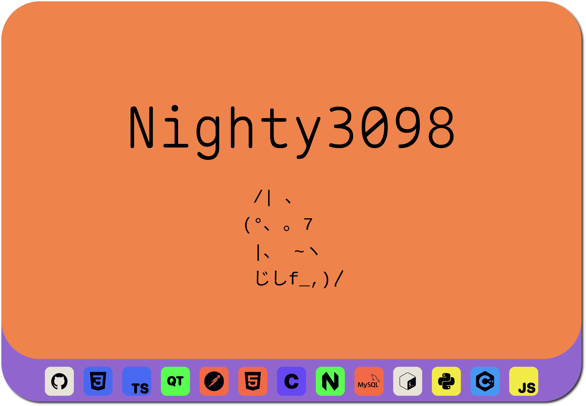

      
    
      
	
      
    <h1 align="center" style="text-decoration: none; font-size: 50px;">Hi 👻</h1>
    <h3 align="center" style="text-decoration: none; font-size: 21px;">I am a 17 y.o. junior c++/python developer and freelancer from Novosibirsk. I have been developing for 4 years and working with gtk, qt, telegram-api. </h3> 
     
    
     
    
     
    
     

    <h3 align="center">Contact with me</h3>
    
    
    
      

<h3 align="center">Langs</h3>

	
	
	
	
	
	
	
	

 
<h3 align="center">Tools</h3>

	
	
 	
	
	
	
	
	
	
	 
	
	
	
	
	

 

<h3>GitHub Stats</h3>

    
       
    
    
    
    
    
 

	
<h3 align="center">Wakatime</h3>

	

		
	

	
<h3 align="center">Repos</h3>

	

		
		  
		
		  
		
		  
		
		  
		
		  
		
		  
		
		  
		
	

    

	

